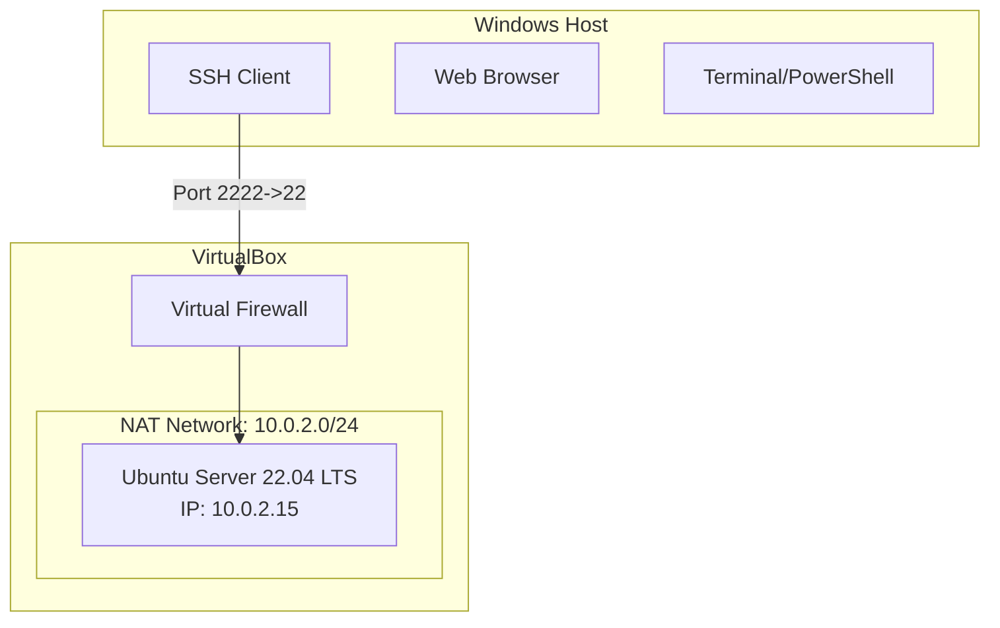

# Week 1: System Planning and Distribution Selection

## 1. System Architecture Diagram

The system consists of a virtualized Linux server communicating with the host workstation via a private network.



## 2. Distribution Selection Justification

**Selected Distribution:** Ubuntu Server 22.04 LTS

**Comparison and Justification:**

| Feature | Ubuntu Server 22.04 LTS | Debian 11 (Bullseye) | CentOS Stream 9 |
| :--- | :--- | :--- | :--- |
| **Package Management** | APT (Advanced Package Tool) - User friendly, vast repositories. | APT - Stable but older packages by default. | DNF/RPM - Upstream for RHEL, slightly different syntax. |
| **Stability** | High (LTS supported for 5 years). | Extremely High (Stable branch). | Good (Rolling-release like). |
| **Documentation** | Extensive community and official support. | Excellent but technical. | Good enterprise focus. |
| **Security Updates** | Creating security updates is automated and reliable via `unattended-upgrades`. | Strict guidelines, very stable. | Frequent updates. |

**Decision:**
I chose **Ubuntu Server 22.04 LTS** because it strikes the best balance between stability and usability. The extensive documentation and community support are ideal for troubleshooting during this learning process. Its native support for `unattended-upgrades` and `AppArmor` (required in Phase 5) makes it a strong candidate for the security requirements of this coursework.

## 3. Workstation Configuration Decision

**Selected Option:** Option B (Host Machine with SSH Client)

**Justification:**
I am using my Windows host machine as the workstation.
- **Tools**: Windows PowerShell / Command Prompt supports OpenSSH natively (`ssh`).
- **Efficiency**: Running a second VM (Option A) would consume unnecessary resources (RAM/CPU) which are better dedicated to the Server VM to analyze its performance without host-level contention.
- **Workflow**: This simulates a real-world scenario where a sysadmin administers a remote cloud server from their local laptop.

## 4. Network Configuration

**Virtualization Platform:** Oracle VM VirtualBox

**Network Settings:**
- **Adapter 1:** NAT (Network Address Translation)
    - **Port Forwarding:**
        - Rule Name: `SSH`
        - Protocol: `TCP`
        - Host IP: `127.0.0.1`
        - Host Port: `2222`
        - Guest IP: `10.0.2.15` (Default VirtualBox NAT IP)
        - Guest Port: `22`

This configuration allows me to SSH into the server using `ssh -p 2222 user@127.0.0.1` while keeping the server isolated from the external network for direct inbound connections, satisfying the security requirements.

## 5. System Specifications

*Note: Determining specs requires the VM to be running. Below are the commands I will use to document them once the VM is installed in Week 4.*

> **Evidence Required**: Run the following commands and capture a screenshot for each.


### Kernel Version
```bash
uname -a
```

### Memory Usage
```bash
free -h
```

### Disk Space
```bash
df -h
```

### Network Interfaces
```bash
ip addr
```

### Distribution Release Info
```bash
lsb_release -a
```
